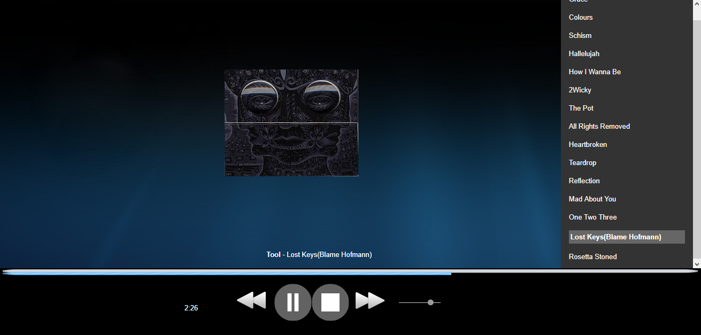
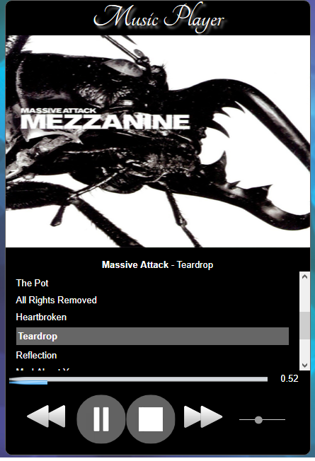

# Responsive Music Player

 A fully functional responsive Music Player using the HTML5, CSS3 and JavaScript audio API. It allows you to create a playlist of songs and play, pause, stop, rewind and skip through tracks.
|                           |                           |
| -------------------------:|:------------------------- |
|||
  

## Deployment

This website is hosted in github [Music Player](https://tetrachromat.github.io/Responsive_Music_Player.github.io/)

## Built With

* [HTML5](https://www.w3schools.com/html/default.asp)
* [CSS3](https://www.w3schools.com/css/default.asp/)
* [Javascript](https://www.w3schools.com/js/default.asp)

## Author

Sagar Maharjan - [SagarMhrjn](https://github.com/tetrachromat)

## License

This project is licensed under the MIT License
